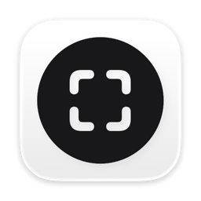

# ScreenKit

  

A menu-bar screen capture tool for macOS 26 (Tahoe) and later. Press a hotkey, drag a pixel-precise selection or click a window, and the shot goes straight to your clipboard and into a local library for cropping, annotating, or turning into a video.

[brandkit.pro/screenkit](https://brandkit.pro/screenkit)

## Features

- Area and window capture, with a magnifier that follows the cursor while you select.
- A built-in measurement ruler: arrow keys measure the gap between edges under the cursor, ⇧ measures the outer bounds, and a click imprints the measurement onto the capture.
- Every capture copies to the clipboard automatically and is also saved to a local library.
- Library editor: crop, arrows, shapes, numbered steps, and a magnifier annotation that draws an enlarged detail beside the original.
- Video recording of any selected area, with pause/resume from the menu bar, a live recording timer, and trimming in the built-in editor.
- Optional cursor effects for recordings: click rings (a distinct color for right-click, staggered rings on double or triple clicks), a press-and-hold ring, a fading drag trail, and an auto zoom that eases in on clicks.
- Color picker: `C` copies the hex value under the crosshair and cycles formats on repeat presses, `⇧C` samples the darkest pixel in a 20×20 area.
- OCR: select an area to recognize the text in it and copy it to the clipboard without saving an image.
- Automatic JPEG/PNG format detection based on how photographic a capture looks; the clipboard copy always stays lossless PNG.
- Captures can clean themselves up automatically after 1, 7, 15, or 30 days, or be kept forever.
- Configurable hotkey and menu bar icon.

## Privacy

Runs entirely on your Mac. No servers, no analytics, no network calls of its own. Text recognition runs on-device through Apple's Vision framework. The only permission it asks for is Screen Recording.

## Install

Download the latest DMG from [Releases](https://github.com/tretten/screenkit/releases), drag ScreenKit to Applications, and grant Screen Recording when prompted (System Settings → Privacy & Security → Screen & System Audio Recording). Builds are signed and notarized, and the app checks for updates daily, installing the next time you quit.

---

This repository holds only signed release builds (DMG/ZIP) for the auto-update feed. It does not contain source code.
